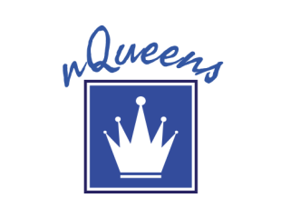
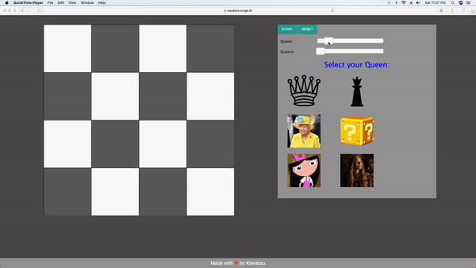

 

------------------------------------------

> A Simple In-browser simulator of nQueens Algorithm.

> The N Queen is the problem of placing N chess queens on an N×N chessboard so that no two queens attack each other. 

> This project aims at explaining backtracking with the help of nQueens algorithm in a fun and easy-to-understand method.

> To try out go to: [nQueens Simulator](https://nqueens.surge.sh)

##### Demo 

------------------------------------------

### Future Goals
- [ ] Improve CSS and add mobile support.
- [ ] Implement option for Branch and Bound method.
- [ ] Calculating all possible solutions.
- [ ] Add Stats like total time taken, total iterations,etc.
- [ ] Exporting possible solutions in form of png/pdf.
- [ ] Adding a algorithm view like [here](https://visualgo.net/)
- [ ] Distributed computing for very large n.
- [ ] Adding support for, What if k queens are fixed originally? Is a solution possible?
- [ ] Adding more Queens:smile:.

------------------------------------------
### Contributing
 We're are open to `enhancements` & `bug-fixes` :smile: 

 Feel free to complete the Future Goals.
### Note

 This project was done under `4 hours with no pre-preparation`

------------------------------------------
### Contributors

- [@Korusuke](https://github.com/Korusuke)

------------------------------------------

Made with &hearts; by <a href="https://github.com/Korusuke" target="_blank">Korusuke</a>

